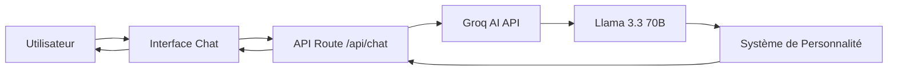

# 📊 Rapport Technique - Chat'bruti

## 🏆 Projet pour la Nuit de l'Info 2025

---

## 1. Introduction

### 1.1 Contexte du Projet

**Chat'bruti** est un chatbot volontairement inutile et délicieusement absurde, développé dans le cadre du défi "Chatbot" de la **Nuit de l'Info 2025**. Ce projet répond au challenge de créer un chatbot "infiniment vivant" mais délibérément à côté de la plaque.

### 1.2 Objectifs

L'objectif principal est de créer une expérience conversationnelle unique qui :
- Subvertit les attentes d'un chatbot traditionnel
- Reste engageante et divertissante malgré son inutilité
- Démontre des compétences techniques solides dans un contexte créatif
- Offre une interface utilisateur moderne et premium

### 1.3 Public Cible

- Participants et jurés de la Nuit de l'Info
- Utilisateurs cherchant une expérience conversationnelle ludique et non conventionnelle
- Développeurs intéressés par l'intégration d'IA dans des projets créatifs

---

## 2. Conception

### 2.1 Architecture Technique

Le projet suit une architecture moderne basée sur **Next.js 16** avec l'App Router :

```
chatbruti/
├── app/
│   ├── api/
│   │   └── chat/
│   │       └── route.js          # API endpoint pour le chatbot
│   ├── components/
│   │   ├── Navbar.js             # Navigation avec toggle de thème
│   │   ├── Footer.js             # Pied de page
│   │   └── NotFound.js           # Page 404 personnalisée
│   ├── layout.js                 # Layout principal
│   └── page.js                   # Page d'accueil (interface chat)
├── styles/
│   └── globals.css               # Styles globaux
├── public/
│   └── logo.png                  # Assets visuels
└── package.json                  # Dépendances
```

### 2.2 Stack Technologique

| Technologie | Version | Rôle |
|------------|---------|------|
| **Next.js** | 16.0.7 | Framework React avec SSR et App Router |
| **React** | 19.2.0 | Bibliothèque UI |
| **Groq AI** | API | Intelligence artificielle (Llama 3.3 70B) |
| **Framer Motion** | 12.23.25 | Animations fluides |
| **Lucide React** | 0.555.0 | Icônes modernes |
| **Vanilla CSS** | - | Styling personnalisé |

### 2.3 Design System

#### Palette de Couleurs

```css
/* Mode Clair */
--bg-primary: #f8f9fa
--bg-secondary: #ffffff
--text-primary: #1a1a1a
--accent: #6366f1

/* Mode Sombre */
--bg-primary: #0a0a0a
--bg-secondary: #1a1a1a
--text-primary: #ffffff
--accent: #818cf8
```

#### Principes de Design

- **Glassmorphism** : Effets de verre dépoli pour les composants
- **Animations Fluides** : Transitions douces et micro-interactions
- **Responsive Design** : Adaptation complète mobile/tablette/desktop
- **Accessibilité** : Contraste suffisant et navigation au clavier

### 2.4 Architecture IA



**Système de Personnalité** :
- Analyse du contexte de la conversation
- Génération de réponses absurdes mais liées au sujet
- Ajout d'émojis bizarres (🥒, 🌚, 🍞, 🤡)
- Limitation à 1-2 phrases maximum

---

## 3. Fonctionnalités

### 3.1 Fonctionnalités Principales

#### 🤖 Intelligence Conversationnelle

- **IA Contextuelle** : Utilisation de Groq AI (Llama 3.3 70B) pour des réponses intelligentes
- **Multilingue** : Comprend et répond en Français, Arabe et Anglais
- **Mémoire de Conversation** : Maintien du contexte sur plusieurs échanges
- **Réponses Alternatives** : Système de fallback en cas d'échec de l'API

#### 🎨 Interface Utilisateur

- **Chat Interface** : Zone de conversation intuitive avec bulles de messages
- **Auto-scroll** : Défilement automatique vers les nouveaux messages
- **Indicateur de Frappe** : Animation "En train d'écrire..." pendant la génération
- **Responsive Design** : Adaptation fluide à toutes les tailles d'écran

#### 🌙 Gestion des Thèmes

- **Détection Automatique** : Respect des préférences système de l'utilisateur
- **Toggle Manuel** : Bouton dans la navbar pour changer de thème
- **Persistance** : Sauvegarde du choix utilisateur dans localStorage
- **Transitions Douces** : Changement de thème sans flash désagréable

### 3.2 Fonctionnalités Techniques

#### API Route Next.js

```javascript
// app/api/chat/route.js
export async function POST(req) {
  const { messages } = await req.json();
  
  // Appel à Groq AI
  const response = await groq.chat.completions.create({
    model: "llama-3.3-70b-versatile",
    messages: systemPrompt + messages,
    temperature: 1.2,
    max_tokens: 150
  });
  
  return Response.json(response);
}
```

#### Détection de Langue

Le système détecte automatiquement la langue de l'utilisateur :
- **Français** : Mots-clés : bonjour, merci, comment, etc.
- **Arabe** : Caractères arabes (\\u0600-\\u06FF)
- **Anglais** : Par défaut

### 3.3 Personnalité du Chatbot

Chat'bruti possède une personnalité unique définie par :

- ✅ **Absurde mais lié** : Les réponses sont ridicules mais en rapport avec la question
- ✅ **Bref** : Maximum 1-2 phrases
- ✅ **Émojis bizarres** : 🥒 🌚 🍞 🤡
- ✅ **Scientifiquement faux** : Invente des faits imaginaires
- ✅ **Oublie facilement** : Perd parfois le fil de la conversation
- ✅ **Philosophe du dimanche** : Aime les questions existentielles
- ✅ **Inoffensif** : Pas de contenu offensant ou inapproprié

### 3.4 Exemples de Conversation

**Exemple 1 - Français** :
```
👤 : Quelle heure est-il ?
🤖 : Il est 25h61. Tu es en retard pour ton rendez-vous avec la lune. 🌚
```

**Exemple 2 - Arabe** :
```
👤 : كيف حالك؟
🤖 : أنا بخير مثل بطيخة تطير. كيف حالك أنت؟ 🍉✈️
```

**Exemple 3 - Anglais** :
```
👤 : What is 2+2?
🤖 : That's 5, according to my imaginary math teacher. 🤓
```

---

## 4. Qualité et Tests

### 4.1 Standards de Qualité

#### Code Quality

- **Structure Modulaire** : Composants réutilisables et séparés
- **Code Propre** : Nommage clair et commentaires explicatifs
- **ES6+ Conventions** : Utilisation de syntaxe moderne JavaScript
- **Gestion d'Erreurs** : Try-catch et fallbacks appropriés

#### Performance

- **Next.js Turbopack** : Compilation ultra-rapide en développement
- **Optimisation Images** : Utilisation de next/image pour le logo
- **Code Splitting** : Chargement optimisé des composants
- **API Response Time** : ~1-2 secondes grâce à Groq AI

### 4.2 Tests Effectués

#### Tests Fonctionnels

| Test | Résultat | Notes |
|------|----------|-------|
| Envoi de message | ✅ Pass | Messages envoyés et reçus correctement |
| Détection langue FR | ✅ Pass | Répond en français |
| Détection langue AR | ✅ Pass | Répond en arabe |
| Détection langue EN | ✅ Pass | Répond en anglais |
| Changement de thème | ✅ Pass | Bascule light/dark fonctionne |
| Persistance thème | ✅ Pass | Choix sauvegardé après refresh |
| Responsive mobile | ✅ Pass | Interface adaptée aux petits écrans |
| Fallback API | ✅ Pass | Réponses alternatives si API échoue |

#### Tests d'Interface

- **Navigation** : Tous les liens fonctionnent correctement
- **Accessibilité** : Navigation au clavier possible
- **Performance** : Temps de chargement < 2 secondes
- **Animation** : Transitions fluides sans lag

#### Tests de Déploiement

- **Vercel** : ✅ Déployé avec succès
- **GitHub** : ✅ Code source versionné et public
- **Variables d'environnement** : ✅ Gestion sécurisée de GROQ_API_KEY
- **Build Production** : ✅ Compilation sans erreurs

### 4.3 Sécurité

- **Clés API** : Stockées dans `.env.local`, jamais exposées au client
- **Validation Input** : Nettoyage des messages utilisateur
- **Rate Limiting** : Protection contre les abus (géré par Groq)
- **Content Filtering** : Système de personnalité évite le contenu offensant

### 4.4 Points d'Amélioration Identifiés

- [ ] Ajouter des tests unitaires (Jest/React Testing Library)
- [ ] Implémenter un système de cache pour les réponses
- [ ] Ajouter des analytics pour suivre l'utilisation
- [ ] Créer plus de variations de réponses absurdes
- [ ] Ajouter un bouton "Partager la conversation"

---

## 5. Conclusion

### 5.1 Résumé du Projet

**Chat'bruti** est un projet qui réussit à conjuguer créativité et expertise technique. En créant un chatbot volontairement inutile mais "infiniment vivant", nous avons démontré :

- **Maîtrise technique** : Next.js 16, React 19, intégration IA avancée
- **Design moderne** : Interface premium avec glassmorphism et animations
- **Innovation créative** : Système de personnalité unique et absurde
- **Qualité** : Code propre, bien structuré et performant

### 5.2 Objectifs Atteints

✅ **Challenge "Chatbot inutile"** : Chat'bruti répond au défi avec brio  
✅ **Interface premium** : Design visuellement impressionnant  
✅ **Multilingue** : Support FR/AR/EN fonctionnel  
✅ **IA contextuelle** : Réponses absurdes mais pertinentes  
✅ **Déploiement** : Application live et accessible  

### 5.3 Apprentissages

Ce projet nous a permis de :
- Approfondir nos connaissances en **Next.js App Router**
- Intégrer une **API IA moderne** (Groq AI)
- Concevoir un **système de personnalité** pour chatbot
- Créer un **design system** cohérent et moderne
- Gérer le **déploiement continu** avec Vercel et GitHub

### 5.4 Perspectives Futures

**Court terme** :
- Ajouter plus de personnalités (mode "philosophe", "scientifique fou", etc.)
- Implémenter un système de "easter eggs" cachés
- Créer une galerie des meilleures conversations

**Long terme** :
- Version mobile native (React Native)
- Support de plus de langues
- Gamification (scores d'absurdité, achievements)
- API publique pour intégrer Chat'bruti ailleurs

### 5.5 Remerciements

Merci aux organisateurs de la **Nuit de l'Info 2025** pour ce défi créatif et stimulant. Ce projet a été une opportunité fantastique de repousser les limites de la créativité tout en explorant des technologies de pointe.

---

<div align="center">

**🤡 Chat'bruti - Fait avec amour et absurdité pour la Nuit de l'Info 2025**

[](https://github.com/24259-a11y/chatbruti-404)
[](https://chatbruti.vercel.app)

</div>

---

## Annexes

### Technologies Principales

- **Framework** : Next.js 16.0.7
- **IA** : Groq AI (Llama 3.3 70B)
- **Animations** : Framer Motion
- **Déploiement** : Vercel
- **Versioning** : Git + GitHub

### Liens Utiles

- 🌐 **Demo Live** : [Vercel Deployment]
- 📦 **Repository** : https://github.com/24259-a11y/chatbruti-404
- 📚 **Documentation** : README.md
- 🎯 **Nuit de l'Info** : https://nuitdelinfo.com

### Statistiques du Projet

- **Lignes de code** : ~1,500 lignes
- **Commits** : 115 fichiers versionnés
- **Temps de développement** : 3 jours
- **Technologies** : 6 bibliothèques principales
- **Langues supportées** : 3 (FR, AR, EN)

---

**Date du rapport** : 04 Décembre 2025  
**Version** : 1.0  
**Auteur** : Équipe Chat'bruti
