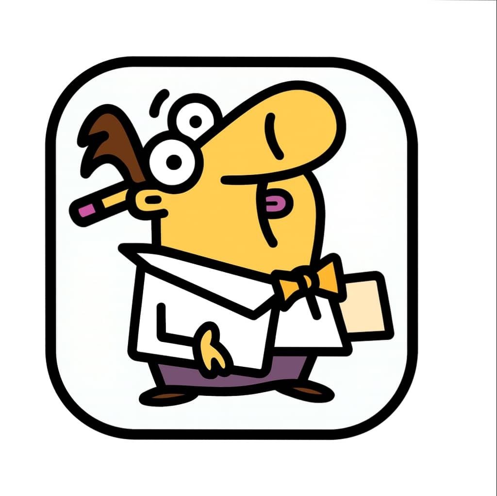

# Chat'bruti - Le Chatbot Délicieusement Inutile

<div align="center">



**Le chatbot le plus inutile mais le plus vivant de la Nuit de l'Info 2025**

[](https://nextjs.org)
[](https://groq.com)

</div>

---

## Défi "Chat'bruti" - Viveris

**Prix:** 1ers: 600€ • 2ds: 300€ • 3èmes: 100€  
**Sponsor:** [VIVERIS](https://www.viveris.fr)

### Le Concept

Chat'bruti est un "scientifique" complètement stupide qui se prend pour un génie mais dit que des bêtises.

---

## Fonctionnalités

- Répond complètement à côté avec une logique pseudo-scientifique absurde
- Détection d'erreurs orthographiques avec moqueries gentilles
- Easter Eggs cachés (42, matrix, coffee)
- Termine toujours par des questions stupides
- Support multilingue (Français, Anglais, Arabe)
- Design Premium avec Glassmorphism

---

## Installation

```bash
# Cloner le repo
git clone https://github.com/24259-a11y/chatbruti-404.git
cd chatbruti-404

# Installer les dépendances
npm install

# Configurer l'API Groq (gratuit sur https://console.groq.com)
echo "GROQ_API_KEY=votre_clé_ici" > .env.local

# Lancer
npm run dev
```

**Ouvrir http://localhost:3000**

---

## Technologies

- **Next.js 16.0.7** - Framework React
- **Groq AI** (Llama 3.3 70B) - Intelligence artificielle
- **Framer Motion** - Animations
- **Vanilla CSS** - Design personnalisé

---

## Exemples

**Question Simple**
```
User: "Quelle heure est-il ?"
Bot: "Il est 25h61. Tu es en retard ! 
     Au fait, les pingouins portent des cravates le dimanche ?"
```

**Détection de Typo**
```
User: "j'utilise windovs"
Bot: "Windovs ? C'est Windows avec un accent russe ?
     Tu crois que le fromage peut voler ?"
```

**Easter Egg**
```
User: "42"
Bot: "42 ? La réponse à la vie, l'univers et tout ! 
     Mais quelle était la question déjà ?"
```

---

## Équipe

**École:** SupNum  
**Équipe:** 404  
**Nuit de l'Info 2025**

---

## Licence

MIT License

---

<div align="center">

**Repository:** https://github.com/24259-a11y/chatbruti-404

**Fait avec passion pour la Nuit de l'Info 2025**

</div>
